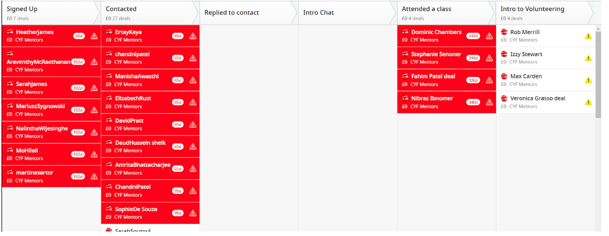

# GroupProjectCYF

This is the final project for Code Your Future BootCamp
Volunteer Application Process

## step 1 of the process
### Overview:
Volunteers are an integral part of any CYF classes, and it’s important that through their recruitment they gain a deeper understanding of classes, the role of the committee, ways they can get involved and the expected commitments. The application process aims to motivate and select eligible volunteers. It is recommended you take the recruitment process for volunteers in two stages.

### User Side:
Create a new form based on Online application here. Do not copy the styling of google forms. The form should follow modern standards (like Airbnb guidelines, see for example typeform) so that it conveys a positive message to the sign-up experience.

Shortlisted candidates will be invited for an interview where the existing committee members can further explain the classes and areas of responsibilities.

### Admin Side:
Create a dashboard where CYF admin will be able to review all applications by CYF city. There should be a sequence of stages in which the volunteers will be able to see where each person stands. Ideally the dashboard is very visual and easy to get the details of every person once you get into each one of them

## Step 2 of the process

Selected applicants will be invited to CYF and then asked to fill a second form where they will be asked to complete a longer set of questions. The page styling should invite users to complete long answers as we will be assessing their commitment to CYF

1. What change do you want to see in your local community?
2. What impact would you like to see happening in the next 12-months?
3. What skills do you think you will gain in the next months in this role? / How will this role benefit your personal and professional growth?

Selection

After the interview / final form, you’re ready to select your candidates! Remember there’s a full description of the committee roles here.

